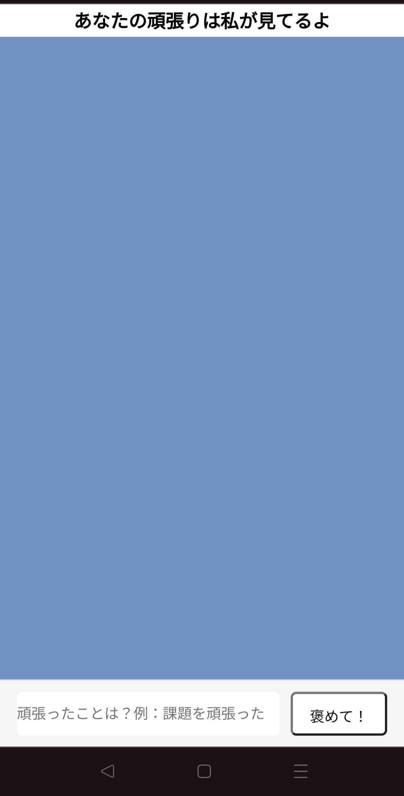
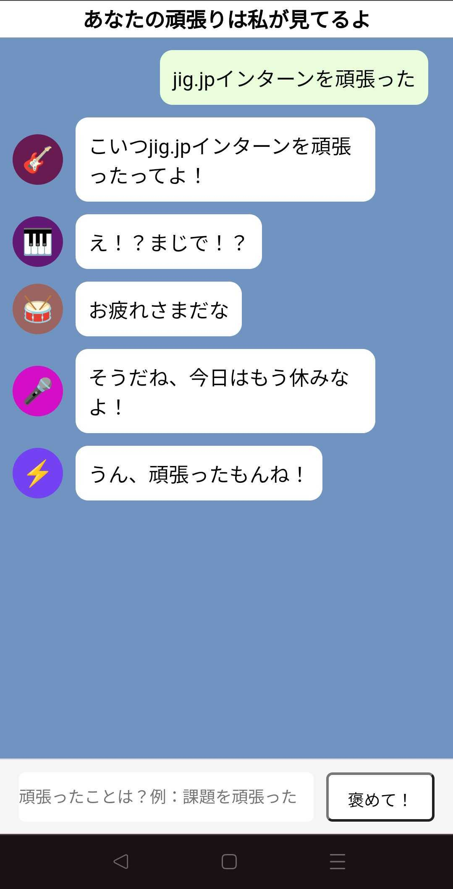

# あなたの頑張りの褒め代行

## 解決したい課題

課題やレポートを友人に見せてほしいと言われ、見せた際にあまり感謝をされている実感がわかないことが多々あった。

何かを実行した際にもっと誉めてほしいと思った。

## その課題の解決策

その実体験をもとに、周りが褒めてくれないのなら代わりに褒めてくれるWebアプリを作成すればいいと思ったことが経緯としてある。

このWebアプリはユーザーが頑張ったと思うことを送信すると、その頑張ったことを褒めてくれるというものになっている。

某SNSアプリのような見た目にすることで、より褒められている実感がわくようになっている。

## 使用方法

画面下部の入力スペースに頑張ったことを入力し、その隣にある **褒めて！** ボタンを押す。

チャット画面に自分の入力した頑張ったことが表示され、他人がそのことを全力で褒めてくれる。

    
